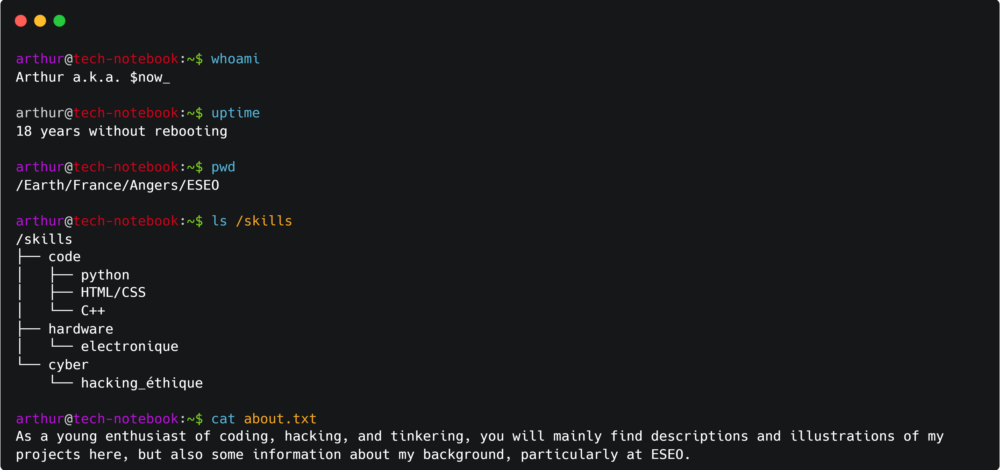

<h1 align="center">Welcome to Sensei-Snow's GitHub</h1>

  🔐 Cybersecurity • 🌐 Web Developpement • 🖥️ Software Developpement

---

## 🚀 About Me 

  

---

## 🛠️ Stack & Tools

  
  
  

---

## 📊 GitHub Stats

  
   
   
  

---
